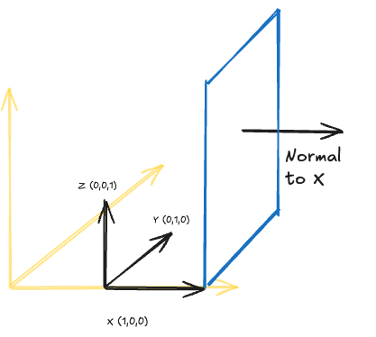

# Conventions 

**I/O**
- Will call file paths `PATH_TO_FILENAME`
- Will call directory paths `DIRECTORYNAME_DIR`
- As variables, use the lowercase `path_to_filename` and `directoryname_dir`

**Defaults and Constants**
- Will keep all defaults in a `defaults` folder or file? 
- Will have examples separately

**Folder organization inside the design modules**
- data: reading json, will also have the json typed dict that is expected, and should throw error, maybe use pydantic
- interfaces: has types that are used in logic and expected in presentation? 
- logic: actual work 
- presentation: functions that `ezcase/main.py` will call... 

## Geometry
**Unit Vectors**

**Order of points defining a closed polgyon**
- Use EnergyPlus default [geometry rules](https://bigladdersoftware.com/epx/docs/22-2/input-output-reference/group-thermal-zone-description-geometry.html#globalgeometryrules): 
  - Start Vertex: UpperLeftCorner
  - Vertex Entry Direction: CounterClockWise
  - Ex: N-E-S-W
